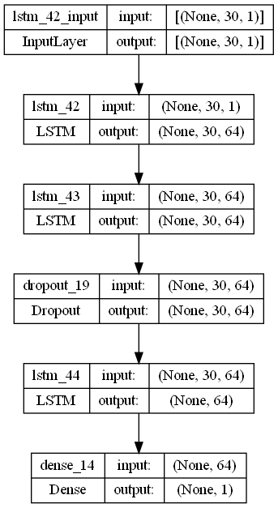
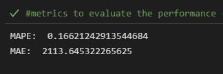
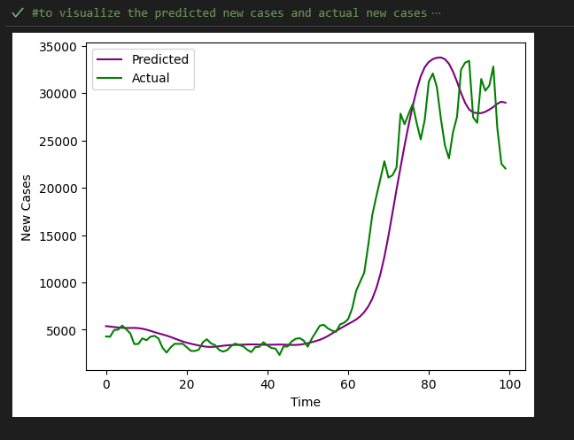

## Badges
 
 
 
 
 

# Covid 19 Cases Prediction
 Deep Learning project on how to predict new cases of Covid-19.
 
## Project Description
The purpose of this project is to create a Deep Learning model by using LSTM neural network to predict new cases of Covid-19 in Malaysia using the past 30 days of number of cases.

### Project Details 
(A). Data Loading  

<ul>
  <li>Load the dataset into this project using pandas.</li>
</ul>

(B). Data Inspection  

<ul>
  <li>Check the data type of 'cases_new' column - object datatype</li>
  <li>Check if the dataset has duplicated data - found 0 duplicates data</li>
  <li>Check if the dataset has any missing values - 12 missing values found</li>
</ul>

(C). Data Cleaning  

<ul>
  <li>Change the data type of 'cases_new' column to int64</li>
  <li>Fill in missing values - by using Interpolation</li>
</ul>

(D). Features Selection  

<ul>
  <li>No features to select</li>
</ul>

(E). Data Pre-Processing  

<ul>
  <li>Expand the dimension of 'cases_new' column using numpy</li>
  <li>Normalization by using Min-Max Scaling</li>
  <li>Fit and Transform the data</li>
  <li>Define the x train and y train</li>
  <li>Train Test Split the data</li>
</ul>

(F). Model Development  

<ul>
  <li>Create Sequential Model</li>
  <li>Add LSTM layers</li>
  <li>Add Dropout layers</li>
  <li>Add Dense layers</li>
  <li>Model Summary</li>
</ul>

(G). Model Compilation  

<ul>
  <li>Compile the model</li>
    <ul>
      <li> Optimizer - adam </li>
      <li> Loss - 'mse'</li>
      <li> Metrics - ['mse','mape']</li>
    </ul>
</ul>

(H). Callbacks - Early Stopping and TensorBoard 

<ul>
  <li>Tensorboard logs after every batch of training to monitor metrics</li>
  <li>Save model to disk</li>
</ul>

(I). Model Training  

<ul>
  <li>Train the model for 100 epochs and get the best val_loss</li>
</ul>

(J). Model Evaluation  

<ul>
  <li>Plot the training and validation loss</li>
  <li>Load and Inspect testing dataset</li>
  <li>Concatenation the train and test data</li>
  <li>Get the model prediction</li>
  <li>Visualize the predicted new cases and actual new cases</li>
  <li>Evaluate the performance by using MAPE and MAE</li>
</ul>

(K). Model Saving

<ul>
  <li>Save the model</li>
    <ul>
      <li>Min-Max Scaler</li>
      <li>Save Model</li>
    </ul>
</ul>

## Results
### Model Architecture

   
 

  
  
### Model Performance

  

    
### Predicted and Actual Graph

  

 
## Acknowledgement
Special thanks to **(GitHub - MoH-Malaysia/covid19-public: Official data on the COVID-19
epidemic in Malaysia. Powered by CPRC, CPRC Hospital System,
MKAK, and MySejahtera)** for the dataset used for this project.

Link: https://github.com/MoH-Malaysia/covid19-public
